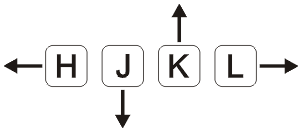

# neovim

Parte traduzida de: [Neovim, Instalación y Configuración Básica](https://stsewd.dev/es/posts/neovim-installation-configuration/)

## Primeiros passos com Neovim

A seguir, você aprenderá o básico para começar a usar o Neovim como editor de código. A princípio, parecerá que é contraproducente e que você precisa digitar muito para realizar uma ação simples; Existem outras maneiras mais eficientes de fazer isso, mas o objetivo é se familiarizar com a edição de texto antes de passar para coisas mais avançadas. Ao final da postagem você encontrará diversos recursos para saber mais sobre o Neovim / Vim.

**Obs.:** Tudo o que você aprende nesta seção também é válido para o Vim.

### Modos

Neovim tem 3 modos principais:

- **Modo normal** - onde todas as teclas são interpretadas como comandos.
- **Modo de inserção** - onde você pode escrever tudo o que digitar.
- **Modo visual** - onde você pode selecionar blocos de texto.

Para entrar e sair de cada modo:

- Para ++entrar++ no ++modo de inserção++, pressione  **`i`**.
- Para ++sair++ do ++modo de inserção++, pressione  **`Esc`**.
- Para ++entrar++ no ++modo visual++, pressione  **`v`**.
- Para ++sair++ do ++modo visual++, pressione  **`Esc`**.

Quando você abre o Neovim, o modo padrão é normal.

**Obs.:** Sempre que você sentir que perdeu uma etapa, pressione **`Esc`** pelo menos três vezes para voltar ao ++modo normal++ e reiniciar.

#### Abra um arquivo

Você pode abrir um arquivo do terminal com:

```bash
nvim mi-archivo.txt
```

#### Movendo-se no editor

Anteriormente, eu disse que você pode usar as teclas de seta para se mover, mas não é o mais eficiente quando você usa o Neovim, as teclas de seta estão longe de sua linha inicial. Você pode usar as seguintes teclas para mover dentro do modo normal.

**`h`** - esquerda  
**`j`** - a baixo  
**`k`** - a cima  
**`l`** - direita  



Você também pode usar **`w`** e **`b`** para se mover entre as palavras.

No início será difícil não fazer isso com as setas do teclado, tente praticar até se sentir confortável, sem perder a cabeça nem as teclas.

### Gravar em um arquivo

Para começar a escrever, você deve entrar no modo de inserção com **`i`**. Observe como a forma do cursor mudou, insira algum texto e, quando terminar, pressione **`Esc`** para retornar ao modo normal.

##### ==Salvar==

No modo normal, pressione **`:`**, digite **`w`** e pressione enter.

##### ==Sair==

No modo normal, pressione **`:`** e, em seguida, digite **`q`** e pressione **`enter`** (para sair sem salvar as alterações, você deve digitar **`q!`**).

##### ==Selecionar texto==

Pressione **`v`** para entrar no modo visual, mova o cursor para fazer a seleção. Pressione **`Esc`** para retornar ao modo normal.

##### ==Copiar e colar==

Selecione um texto usando o modo visual e pressione **`y`**. Pressione **`p`** para colar depois do cursor ou **`P`** para colar antes do cursor.

Para copiar uma palavra, no modo normal, pressione **`yiw`** ou, para copiar a linha atual, pressione **`yy`**.

##### ==recortar==

Selecione um texto usando o modo visual e pressione **`d`**. Para recortar uma palavra, no modo normal pressione **`diw`** ou para recortar a linha atual pressione **`dd`**.

Para colar o texto recortado, pressione **`p`**.

##### ==Copiar e colar da área de transferência==

Se você tentou colar texto fora do Neovim, ou colar algo que copiou para a área de transferência, pode ter percebido que não funciona. Para usar a área de transferência, você deve copiar usando **`"+y`**, e colar da área de transferência **`"+p`**.

##### ==Desfazer e refazer==

Para desfazer, no modo normal, pressione **`u`**; e para refazer **`Ctrl + r`**.

##### ==Aviso==

Você pode ficar tentado a usar **`Ctrl + z`**, se o fez e seu editor fechado, não se preocupe, apenas digite **`fg`** no terminal e você terá seu editor de volta.

##### ==Auto completar==

No modo de inserção, digite o início de uma palavra e pressione **`Crtl + p`** ou **`Ctrl + n`** para repetir as sugestões.

### Modo de linha de comando

O Neovim tem outro modo, o modo de linha de comando. Ele aparece abaixo do editor onde você pode inserir um comando, após executá-lo (com Enter) o editor retorna ao modo normal.

Parece familiar, não é? Você já o usou para salvar e sair! Para entrar neste modo, digite **`:`** do modo normal.

A partir de agora, quando você vir caracteres precedidos por **`:`** você saberá que quero dizer que você executa um comando no modo de linha de comando. Por exemplo, para salvar **`:w`**.

**Obs.1:** Enquanto estiver no modo de linha de comando, você pode usar **`Tab`** para autocompletar.

**Obs.2:** O comando **`:w`** é a abreviação de **`:write`**, teste-o!

### Trabalhar com vários arquivos

Para trabalhar com vários arquivos costumamos usar abas, o Neovim tem abas, mas não são exatamente as mesmas que nos outros editores, em vez disso usaremos buffers.

Podemos abrir vários arquivos do terminal com:

```bash
nvim archivo-um.txt archivo-dois.txt
```

Ou se você já está com o Neovim aberto, pode usar o comando **`:e <arquivo>`** , por exemplo **`:e arquivo-um.txt`** .

Pode parecer que não há nenhum outro arquivo aberto, mas há. Você pode listar todos os buffers com **`:ls`**; para mudar para o próximo buffer use **`:bnext`** e para o anterior **`:bprevious`**; para fechar o buffer atual **`:bdelete`**.

**Obs.:** Os comandos **`:bn`** e **`:bp`** são abreviações de **`:bnext`** e **`:bprevious`**.

### Buscar

No modo normal, pressione **`/`**, digite a palavra a ser pesquisada e pressione **`Enter`**. Mova para a próxima correspondência ou anterior com **`n`** e **`N`**.

### Obtendo ajuda

Para obter ajuda, você pode usar o comando **`:help [tópico]`**, por exemplo **`:help :w`** para obter ajuda sobre o comando **`:w`**.

**Obs.:** O comando **`:help`** pode ser abreviado como **`:h`**.

### Aprendendo com Neovim

Neovim inclui um tutorial interativo, execute o comando **`:Tutor`** para começar.

### Configurando o Neovim

O Neovim pode ser configurado no modo de linha de comando, teste exibindo os números da linha executando **`:set number`**. Quer ver o nome do arquivo que está editando na janela do terminal? **`:set title`**.

Se você fechar o Neovim, todas as configurações serão perdidas, para mantê-las um arquivo ***init.vim*** é usado, que é carregado toda vez que o Neovim é iniciado.

### init.vim

**Obs.:** Se você usar o ***Vim***, este arquivo terá a mesma função do arquivo ***.vimrc***.

Este arquivo está localizado em **`~/.config/nvim/init.vim`**, se não existir, crie-o.

```bash
cd ~/.config/
mkdir nvim
touch nvim/init.vim
```

Abra o arquivo e adicione a linha:

```bash
set number
```

Para que as alterações tenham efeito, você deve reabrir o Neovim ou pode executar o comando **`:so ~/.config/nvim/init.vim`**.

O arquivo de configuração pode ficar muito grande, então tente documentar tudo que você colocou nele (você pode adicionar comentários com "), e não copie e cole nenhuma configuração sem entendê-la, então você terá um ***init.vim*** bacana.

**Obs.:** É recomendado colocar seu ***init.vim*** no topo de um sistema de controle de versão, como o git.

Abaixo você tem um ***init.vim*** com algumas configurações mínimas.

```bash
set title  " Mostra o nome do arquivo na janela do terminal
set number  " Mostra os números das linhas
set mouse=a  " Permite a integração do mouse (selecione o texto, mova o cursor)

set nowrap  " Não divida a linha se for muito longa

set cursorline  " Destacar a linha atual
set colorcolumn=120  " Exibe a coluna de limite para 120 caracteres

" Recuo de 2 espaços
set tabstop=2
set shiftwidth=2
set softtabstop=2
set shiftround
set expandtab  " Insira espaços em vez de <Tab>s

set hidden  " Permitir a mudança de buffers sem ter que salvá-los

set ignorecase  " Ignore letras maiúsculas ao fazer uma pesquisa
set smartcase  " Não ignore as letras maiúsculas se a palavra de pesquisa contiver letras maiúsculas

set spelllang=en,es  " Corrigir as palavras usando dicionários em inglês e espanhol

set termguicolors  " Ativar true colors no terminal
set background=light  " Fundo do tema: claro ou escuro
colorscheme zellner  " Nome do tema
```

**Obs.1:** Para que as alterações do set termguicolors tenham efeito, você deve reabrir o Neovim.

**Obs.2:** Para ver todos os temas digite **`:colorscheme`** dê um espaço e use a tecla **`Tab`** para iterar sobre eles.

### Mapeamentos

Vários comandos foram usados para interagir com o Neovim, mas ter que digitá-los a cada vez para alterar os buffers ou salvar um arquivo não parece ser tão produtivo.

O Neovim nos permite definir nossos próprios atalhos de teclado (mapeamentos). Por exemplo, se quiséssemos usar **`Ctrl + s`** para salvar, bastaria colocar esta linha no arquivo ***init.vim***.

```bash
nnoremap <C-s> :w<CR>
```

Freqüentemente, você verá combinações que usam , vamos nos referir a ela como a chave principal, ela é reservada para atalhos definidos pelo usuário. Por padrão, a chave inicial é **`\`**, mas é um pouco difícil de digitar, então a tecla **`Espaço`** ou **`,`** é freqüentemente usada como substituta.

Aqui estão alguns mapeamentos que podem ser úteis.

```bash
let g:mapleader = ' '  " Defina o espaço como tecla líder

nnoremap <leader>s :w<CR>  " Guardar como <líder> + s

nnoremap <leader>e :e $MYVIMRC<CR>  " Abra o arquivo init.vim com <líder> + e

" Usar <líder> + y para copiar para a área de transferência
vnoremap <leader>y "+y
nnoremap <leader>y "+y

" Usar <líder> + d para recortar para a área de transferência
vnoremap <leader>d "+d
nnoremap <leader>d "+d

" Usar <líder> + p para colar da área de transferência
nnoremap <leader>p "+p
vnoremap <leader>p "+p
nnoremap <leader>P "+P
vnoremap <leader>P "+P

" Mova para o próximo buffer com <líder> + l
nnoremap <leader>l :bnext<CR>

" Mova para o buffer anterior com <líder> + j
nnoremap <leader>j :bprevious<CR>

" Fechar o buffer atual com <líder> + q
nnoremap <leader>q :bdelete<CR>
```


